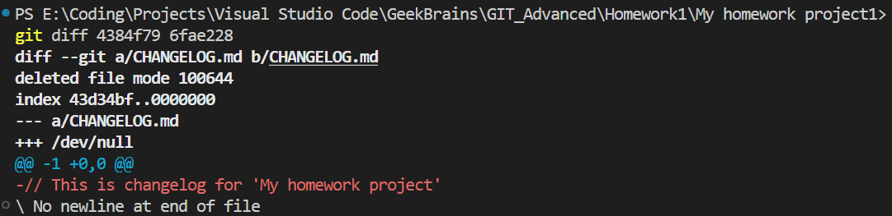
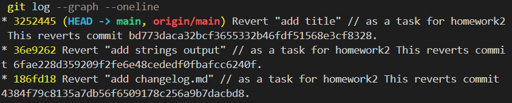

## git-advanced-homework1
### Code checks two strings and evaluates them as anagrams

## git-advanced-homework2
### 1. Просмотрите историю коммитов в своём проекте и выберите три случайных коммита. Просмотрите изменения, которые были в них сделаны.

### 2. Верните эти изменения командой git revert последовательно, чтобы в итоге получилось тоже три коммита.

### 3. Попробуйте отменить эти три коммита:

### * последний — командами git reset --soft и git restore;

### * предпоследний — командой git reset --mixed и git restore;

### * первый — командой git reset --hard.

